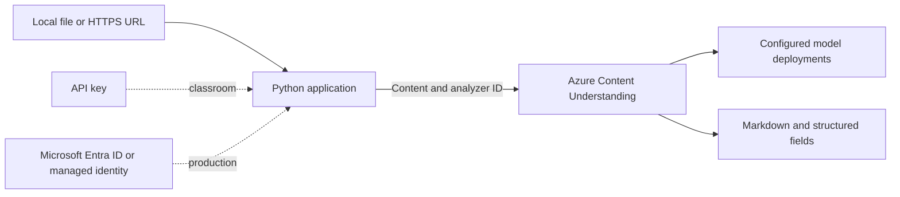

## Workshop Goal

This workshop teaches an Aspire batch how to turn documents, images, audio, and video into structured business data with Azure Content Understanding. Every lab is standalone and supports API-key authentication for learning plus Microsoft Entra ID or managed identity for production.

## Lab Map

| Lab | Business scenario | Analyzer ID | Input |
| --- | --- | --- | --- |
| [Document Layout](01-document-layout-analyzer/README.md) | Prepare loan documents for search | `prebuilt-layout` | PDF or image |
| [Invoice](02-invoice-analyzer/README.md) | Automate accounts payable entry | `prebuilt-invoice` | PDF or image |
| [Call Center](03-call-center-analyzer/README.md) | Review support calls and customer sentiment | `prebuilt-callCenter` | Audio or video |
| [US Tax](04-us-tax-analyzer/README.md) | Classify and extract tax forms | `prebuilt-tax.us` | PDF or image |
| [OCR Read](05-ocr-read-analyzer/README.md) | Digitize scanned field notes | `prebuilt-read` | PDF or image |
| [Document Fields](06-document-fields-analyzer/README.md) | Discover key-value data in unknown forms | `prebuilt-documentFields` | PDF or image |

## Services and Analyzers

Azure Content Understanding is an Azure AI service that converts documents,
images, audio, and video into structured content. An analyzer defines how the
service interprets an input and which fields or representations it returns.
This workshop uses the following prebuilt analyzers, so no custom analyzer
schema or training data is required.

| Analyzer | What it does | Typical output | Best use |
| --- | --- | --- | --- |
| Document Layout | Detects document structure without applying a business-specific schema | Markdown, paragraphs, sections, tables, figures, and page metadata | Search preparation, chunking, and document reconstruction |
| Invoice | Applies an invoice-specific schema to bills and invoices | Vendor, customer, invoice ID, dates, totals, taxes, and line items with confidence | Accounts-payable capture and validation |
| Call Center | Combines speech transcription with conversation understanding | Transcript, speakers, summary, sentiment, topics, and follow-up actions | Support-call review and quality workflows |
| US Tax | Classifies supported US tax forms and extracts tax-specific values | Form category, payer and recipient details, income, and withholding fields | Tax-document intake with human review |
| OCR Read | Recognizes visible text with location and page context | Printed or handwritten text, markdown, words, lines, and coordinates | Text digitization when semantic field extraction is not required |
| Document Fields | Discovers key-value pairs without requiring a fixed domain schema | Inferred field names, values, and confidence scores | Exploring varied forms before defining a custom schema |

The Microsoft Foundry resource supplies the endpoint, authentication boundary,
quota, and model deployments used by Content Understanding. Layout and OCR Read
work without a generative model deployment. The domain analyzers can require
supported chat and embedding model defaults configured in Foundry.

## Bundled Demonstration Assets

Each lab includes a small, fictional asset in its `assets` folder. The samples
contain no real customer, employee, financial, or tax data and can be submitted
directly from the local filesystem.

| Lab | Bundled asset | Demonstrates |
| --- | --- | --- |
| Document Layout | `assets/sample-layout-policy.pdf` | Headings, sections, a table, and a checklist |
| Invoice | `assets/sample-invoice.pdf` | Supplier details, dates, totals, and line items |
| Call Center | `assets/sample-support-call.wav` | A fictional missing-item support conversation |
| US Tax | `assets/sample-w2.pdf` | A clearly marked fictional W-2 training form |
| OCR Read | `assets/sample-field-notes.png` | Printed field notes on a lined page |
| Document Fields | `assets/sample-equipment-request.pdf` | General labels and values in a request form |

Run each command from its lab folder. The analyzers also accept a public `http`
or `https` URL in place of the local asset path.

## Suggested Session Agenda

| Time | Activity |
| --- | --- |
| 15 minutes | Content Understanding concepts, analyzers, and supported content |
| 20 minutes | Deploy the Foundry resource with Bicep |
| 20 minutes | Run Layout and OCR with key authentication |
| 20 minutes | Run Invoice and Document Fields; compare specialized and general extraction |
| 20 minutes | Run Call Center and US Tax; discuss model-backed analyzers |
| 15 minutes | Replace the key with Microsoft Entra ID and managed identity |
| 10 minutes | Questions, costs, security, and cleanup |

## Common Architecture



## Create the Services Manually in the Portals

You need one Microsoft Foundry resource for all six labs. The analyzer IDs are
prebuilt service capabilities, so you do not create six separate Azure resources.
Create the shared resource in the Azure portal, then configure and test Content
Understanding in Microsoft Foundry or Content Understanding Studio.

> [!IMPORTANT]
> Use a [Content Understanding supported region](https://learn.microsoft.com/azure/ai-services/content-understanding/language-region-support#region-support).
> Model availability and quotas vary by region.

### 1. Create a resource group

1. Sign in to the [Azure portal](https://portal.azure.com/).
2. Search for **Resource groups**, then select **Create**.
3. Select your subscription.
4. Enter a resource group name, such as `rg-content-understanding-lab`.
5. Choose a supported region, then select **Review + create** > **Create**.

### 2. Create the Microsoft Foundry resource

1. Open [Create a Microsoft Foundry resource](https://portal.azure.com/#create/Microsoft.CognitiveServicesAIFoundry).
2. On **Basics**, select the same subscription and resource group.
3. Select a supported region, such as **East US**.
4. Enter a globally unique resource name, such as `cu-workshop-<unique-id>`.
5. Select the **S0** pricing tier.
6. For this workshop, allow public network access and keep local key
    authentication enabled.
7. On **Identity**, enable the system-assigned managed identity if that option is
    available during creation. Otherwise, enable it after deployment under
    **Resource Management** > **Identity**.
8. Select **Review + create** > **Create**. Wait for deployment to finish, then
    select **Go to resource**.

These choices match the workshop Bicep templates: an `AIServices` account on the
`S0` tier with a custom endpoint, public network access, key authentication, and
a system-assigned identity.

### 3. Assign access for Microsoft Entra authentication

1. In the Foundry resource, select **Access control (IAM)**.
2. Select **Add** > **Add role assignment**.
3. Assign **Cognitive Services User** to the person who will configure model
    deployment defaults.
4. Add another role assignment for the user, service principal, or managed
    identity that will run the labs.
5. Select **Cognitive Services Content Understanding Reader** when the identity
    only needs to list analyzers and run analysis jobs.
6. Wait several minutes for new role assignments to propagate.

`Cognitive Services User` is required to configure model defaults, even when the
user already owns the Azure resource. Use the narrower Content Understanding
Reader role for analysis-only applications.

### 4. Connect Content Understanding and deploy required models

Content Understanding Studio provides the complete analyzer catalog and can
automatically deploy supported models. This is the recommended workshop setup.

1. Open [Content Understanding Studio settings](https://contentunderstanding.ai.azure.com/settings)
    and sign in with the same Azure account.
2. Select **+ Add resource**.
3. Select the Foundry resource created earlier, then select **Next**.
4. Keep **Enable autodeployment for required models if no defaults are
    available** selected.
5. Select **Save** and wait for deployment and default mapping to complete.

To configure deployments directly in [Microsoft Foundry](https://ai.azure.com/):

1. Select the Foundry resource and open its project. Create a project if the
    portal asks for one.
2. Open **Build** > **Models** > **AI Services** > **Content Understanding
    Playground**.
3. Select the gear icon to open **Configure**.
4. Select existing supported chat-completion and embedding deployments, or deploy
    new models from the panel.
5. Save the deployment selections as the Content Understanding defaults.

Use the models currently recommended by the portal and the
[supported generative models](https://learn.microsoft.com/azure/ai-services/content-understanding/service-limits#supported-generative-models)
page. Do not select a model only because an older workshop example names it.
`prebuilt-layout` and `prebuilt-read` do not require a generative model, but the
other workshop analyzers can require configured model defaults.

### 5. Copy the endpoint and optional key

1. Return to the Foundry resource in the Azure portal.
2. Select **Resource Management** > **Keys and Endpoint**.
3. Copy the endpoint. It normally has this format:
    `https://<resource-name>.services.ai.azure.com/`.
4. Copy **Key 1** only when using classroom key authentication.
5. Open the `.env` file in the lab you want to run and set both values:

    ```dotenv
    CONTENTUNDERSTANDING_ENDPOINT=https://your-resource.services.ai.azure.com/
    CONTENTUNDERSTANDING_KEY=your-api-key
    ```

For Microsoft Entra ID or managed identity, leave
`CONTENTUNDERSTANDING_KEY=` empty. Never commit a populated `.env` file.

### 6. Verify all workshop analyzers

1. Open [Content Understanding Studio](https://contentunderstanding.ai.azure.com/).
2. Select **Browse prebuilt analyzers**.
3. Confirm the following analyzer IDs are available:
    `prebuilt-layout`, `prebuilt-invoice`, `prebuilt-callCenter`,
    `prebuilt-tax.us`, `prebuilt-read`, and `prebuilt-documentFields`.
4. Open an analyzer and run its provided sample data.
5. Check the formatted result and raw JSON before running the matching Python lab.

### 7. Clean up after the workshop

1. In the Azure portal, open **Resource groups**.
2. Select the workshop resource group.
3. Select **Delete resource group**.
4. Enter the resource group name and confirm deletion.

Deleting the resource group removes the Foundry resource, its model deployments,
and workshop role assignments scoped to that resource.

## Authentication Rule Used by Every Lab

The examples use this simple rule:

1. Load the `.env` file beside `analyze.py`.
2. Read `CONTENTUNDERSTANDING_ENDPOINT` from that file.
3. If `CONTENTUNDERSTANDING_KEY` has a value, use `AzureKeyCredential`.
4. Otherwise, use `DefaultAzureCredential`.

Each lab includes an ignored `.env` for local use and a committed `.env.example`
template. For local Entra authentication, leave the key empty and run `az login`.
On Azure compute, application settings take precedence over `.env`, and
`DefaultAzureCredential` automatically detects an assigned managed identity.

## Important Setup Note

`prebuilt-layout` and `prebuilt-read` do not require a generative model. Domain analyzers can require model deployments and one-time default model mappings in the Microsoft Foundry portal. Use a currently supported model and version shown by the portal rather than hardcoding an old version in workshop material.

## Recommended Teaching Order

Start with Layout to explain asynchronous analysis and markdown. Next, compare Invoice with Document Fields to show specialized versus general extraction. Use OCR to discuss text recognition. Finish with Call Center and US Tax to demonstrate multimodal and domain-specific understanding.

## Security Guidance

- Never commit account keys or analysis output containing personal data.
- Keep real values in `.env`; commit only `.env.example`.
- Prefer managed identity for deployed applications.
- Grant `Cognitive Services Content Understanding Reader` for analysis-only workloads.
- Use `Cognitive Services User` only when the workload must also configure analyzer model defaults.
- Use private networking and disable local authentication for production designs after the classroom lab.
