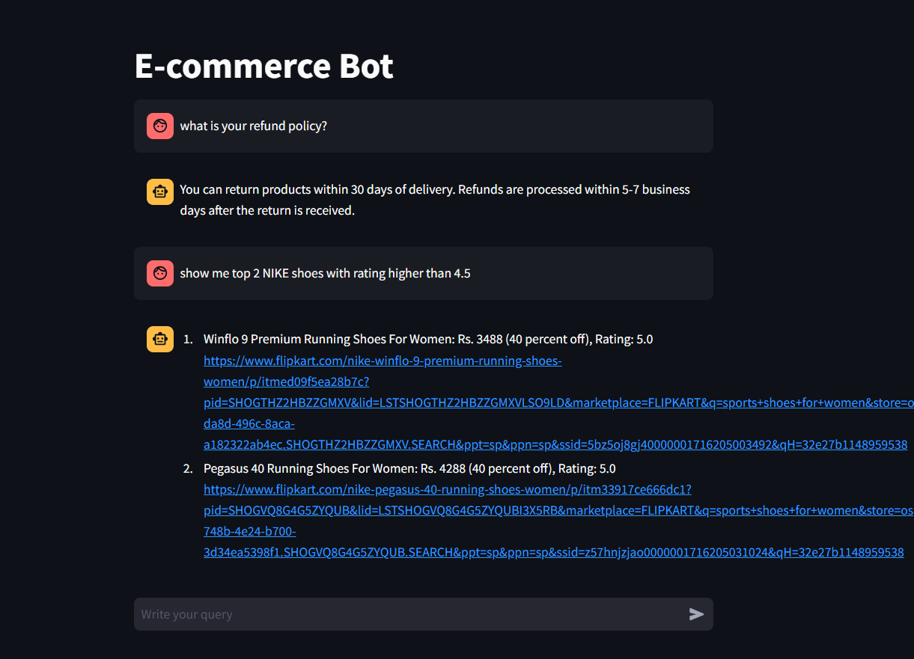

## Overview

E-Commerce ChatBot is a Streamlit application that answers store policy
questions and searches an e-commerce product catalog using natural language.
A semantic router classifies each request and sends it to either the FAQ chain
or the SQL chain.


## Features

* Intent classification with Semantic Router and Hugging Face embeddings
* FAQ retrieval with ChromaDB and sentence-transformer embeddings
* Natural-language product search over SQLite
* SQL generation and response summarization with Groq
* Conversational interface and message history with Streamlit
* Product filtering by brand, category, price, discount, and rating

## How it works

1. The user submits a message in the Streamlit chat interface.
2. Semantic Router embeds the message with
`sentence-transformers/all-MiniLM-L6-v2`.
3. The router selects the `faq` or `sql` processing path.
4. The FAQ path retrieves related ChromaDB entries and asks the language model
to answer using only the retrieved context.
5. The SQL path generates a read-only SQLite query, runs it against the product
catalog, and converts the result into a user-friendly response.
6. The response is added to the Streamlit conversation history.

## Technology stack

| Component        | Technology                                      |
|------------------|-------------------------------------------------|
| User interface   | Streamlit                                       |
| Intent routing   | Semantic Router                                 |
| Embeddings       | Sentence Transformers (`all-MiniLM-L6-v2`)      |
| FAQ vector store | ChromaDB                                        |
| Product database | SQLite                                          |
| Data processing  | pandas                                          |
| Language model   | Groq chat completions                           |
| Configuration    | python-dotenv                                   |

## Project structure

```text
App/
|-- main.py                         # Streamlit entry point and chat history
|-- router.py                       # FAQ and SQL intent definitions
|-- faq.py                          # FAQ ingestion, retrieval, and response chain
|-- sql.py                          # SQL generation, execution, and summarization
|-- db.sqlite                       # Product catalog database
|-- readme.md                       # Project documentation
|-- Resources/faq_data.csv          # FAQ questions and answers
|-- Resources/ecommerce_data_final.csv
|-- Resources/architecture-diagram.png
`-- Resources/product-ss.png        # Example application output
```

## Prerequisites

* Python 3.10 or later
* A Groq API key
* Internet access for the first embedding-model download

## Setup

Run the following commands from the `GenAI_to_AgenticAI_Projects` directory.

### Create a virtual environment

```powershell
python -m venv .venv
.\.venv\Scripts\Activate.ps1
```

### Install dependencies

```powershell
python -m pip install -r requirements.txt
```

### Configure Groq

Create a `.env` file in the same directory and provide the Groq settings.

```dotenv
GROQ_API_KEY=your_groq_api_key
GROQ_MODEL=openai/gpt-oss-120b
```

> [!IMPORTANT]
> Keep `.env` out of source control. If an API key has been exposed, revoke it
> in the provider console and create a replacement.

## Run the application

Start Streamlit from the project root:

```powershell
python -m streamlit run .\E-Commerce_ChatBot\App\main.py
```

Open the local URL printed by Streamlit, normally
<http://localhost:8501>.

## Example questions

FAQ requests:

* What is your return policy?
* How can I track my order?
* What payment methods are accepted?
* How long does it take to process a refund?

Product requests:

* Show me all Nike shoes with a rating higher than 4.8
* Find products cheaper than 2,000 rupees
* List all discounted products
* Show the top two Nike shoes rated above 4.5



## Data sources

The FAQ chain reads questions and answers from
`Resources/faq_data.csv`. The product chain queries the `product` table in
`db.sqlite`, which contains the following fields:

| Field           | Description                              |
|-----------------|------------------------------------------|
| `product_link`  | Product page URL                         |
| `title`         | Product name                             |
| `brand`         | Product brand                            |
| `price`         | Price in Indian rupees                   |
| `discount`      | Discount stored as a decimal fraction    |
| `avg_rating`    | Average rating from 0 to 5               |
| `total_ratings` | Number of submitted product ratings      |

## Routing behavior

Routing quality depends on the example utterances in `router.py`. Add several
representative examples to the appropriate route when a valid request returns
`None` or is sent to the wrong chain. Examples should describe the intent in
different ways rather than repeat the same sentence.

## Troubleshooting

### The route is `None`

Add representative utterances for the missing intent in `router.py`, restart
the application, and test the request again.

### Groq authentication fails

Confirm that `GROQ_API_KEY` is present in `.env`, has not expired, and is
available to the process that starts Streamlit.

### The model is unavailable

Set `GROQ_MODEL` to a chat model available to the configured Groq account, then
restart Streamlit.

### The first startup is slow

The application downloads the sentence-transformer model during its first run.
Later starts can use the local model cache.

### Product searches return no records

Check that `db.sqlite` exists beside `sql.py` and that its `product` table is
populated. Also test broader filters because the requested brand, rating, or
price combination may not exist in the catalog.

## Security notes

* Store credentials in environment variables rather than source files
* Accept only read-only `SELECT` statements in the product query path
* Treat generated SQL as untrusted input before using this pattern with a
  production database
* Restrict database permissions and add stronger SQL parsing for production
  deployments
